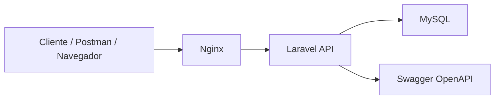
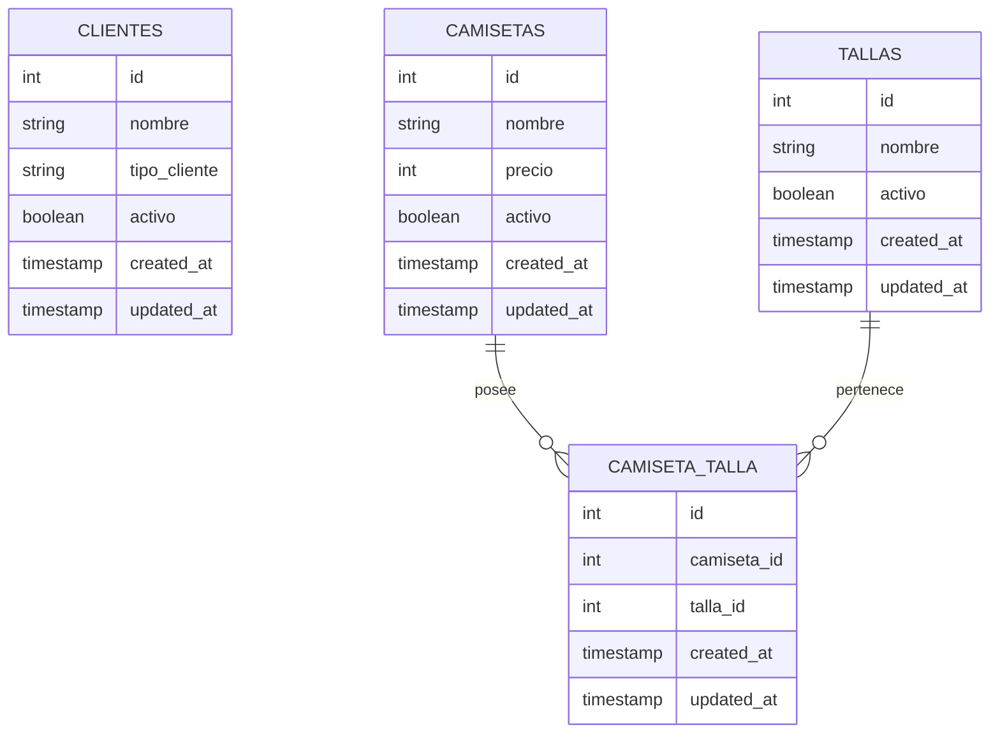

# TodoCamisetas - Examen Final Backend

## Descripción del proyecto

TodoCamisetas es una API RESTful desarrollada con Laravel para la gestión de una tienda de camisetas. El sistema permite administrar clientes, camisetas y tallas, además de relacionar camisetas con múltiples tallas mediante una relación muchos a muchos.

La API también incorpora el cálculo de precio final según el tipo de cliente, permitiendo aplicar una lógica diferenciada para clientes regulares y preferenciales.

## Tecnologías utilizadas

* PHP
* Laravel
* MySQL
* Docker
* Nginx
* Composer
* Swagger / OpenAPI
* L5-Swagger

## Arquitectura general

El proyecto utiliza una arquitectura basada en contenedores Docker:



### Explicación de la arquitectura

* El usuario consume la API desde Postman, navegador o Swagger.
* Nginx recibe las solicitudes HTTP.
* Laravel procesa la lógica de negocio mediante controladores, modelos y rutas.
* MySQL almacena la información persistente.
* Swagger documenta los endpoints disponibles de la API.

## Modelo de datos



## Relaciones principales

### Clientes

Un cliente representa a una empresa o comprador registrado en el sistema. Según su tipo, puede recibir un precio final distinto.

Ejemplo:

* Cliente regular
* Cliente preferencial

### Camisetas

Una camiseta representa un producto disponible para la venta. Contiene información como nombre, precio y estado.

### Tallas

Una talla representa una medida disponible para las camisetas, por ejemplo:

* S
* M
* L
* XL

### Relación muchos a muchos

Una camiseta puede tener muchas tallas y una talla puede estar asociada a muchas camisetas.
Esta relación se resuelve mediante la tabla intermedia `camiseta_talla`.

## Endpoints principales

### Health

| Método | Endpoint      | Descripción                          |
| ------ | ------------- | ------------------------------------ |
| GET    | `/api/health` | Verifica que la API esté funcionando |

### Clientes

| Método    | Endpoint                     | Descripción               |
| --------- | ---------------------------- | ------------------------- |
| GET       | `/api/v1/clientes`           | Lista todos los clientes  |
| POST      | `/api/v1/clientes`           | Crea un nuevo cliente     |
| GET       | `/api/v1/clientes/{cliente}` | Obtiene un cliente por ID |
| PUT/PATCH | `/api/v1/clientes/{cliente}` | Actualiza un cliente      |
| DELETE    | `/api/v1/clientes/{cliente}` | Elimina un cliente        |

### Camisetas

| Método    | Endpoint                       | Descripción                 |
| --------- | ------------------------------ | --------------------------- |
| GET       | `/api/v1/camisetas`            | Lista todas las camisetas   |
| POST      | `/api/v1/camisetas`            | Crea una nueva camiseta     |
| GET       | `/api/v1/camisetas/{camiseta}` | Obtiene una camiseta por ID |
| PUT/PATCH | `/api/v1/camisetas/{camiseta}` | Actualiza una camiseta      |
| DELETE    | `/api/v1/camisetas/{camiseta}` | Elimina una camiseta        |

### Tallas

| Método    | Endpoint                 | Descripción              |
| --------- | ------------------------ | ------------------------ |
| GET       | `/api/v1/tallas`         | Lista todas las tallas   |
| POST      | `/api/v1/tallas`         | Crea una nueva talla     |
| GET       | `/api/v1/tallas/{talla}` | Obtiene una talla por ID |
| PUT/PATCH | `/api/v1/tallas/{talla}` | Actualiza una talla      |
| DELETE    | `/api/v1/tallas/{talla}` | Elimina una talla        |

## Pruebas realizadas

Se validó el funcionamiento del cálculo de precio final usando distintos clientes:

| Cliente   | Tipo         | Precio final |
| --------- | ------------ | ------------ |
| 90minutos | Preferencial | 38000        |
| tdeportes | Regular      | 45000        |

Esto permite demostrar que la API aplica reglas de negocio distintas según el tipo de cliente.

## Swagger

La documentación Swagger se encuentra disponible en:

```txt
http://localhost:8000/api/documentation
```

Desde esta interfaz se pueden revisar los endpoints disponibles, parámetros, respuestas y estructura general de la API.

## Ejecución del proyecto

Levantar los contenedores:

```bash
docker compose up -d
```

Limpiar caché de Laravel:

```bash
docker compose exec app php artisan optimize:clear
```

Ejecutar migraciones:

```bash
docker compose exec app php artisan migrate
```

Generar documentación Swagger:

```bash
docker compose exec app php artisan l5-swagger:generate
```

Verificar rutas:

```bash
docker compose exec app php artisan route:list
```

## URLs importantes

```txt
API base:
http://localhost:8000/api

Health:
http://localhost:8000/api/health

Swagger:
http://localhost:8000/api/documentation
```

## Estado final del proyecto

El proyecto cuenta con:

* Docker funcionando.
* Laravel funcionando.
* MySQL funcionando.
* Nginx funcionando.
* Swagger funcionando.
* Migraciones creadas.
* Modelos creados.
* CRUD de clientes funcionando.
* CRUD de camisetas funcionando.
* CRUD de tallas funcionando.
* Relación muchos a muchos entre camisetas y tallas funcionando.
* Endpoint health funcionando.
* Cálculo de precio final funcionando.
* Documentación técnica incluida en README.


## Repositorio:
https://github.com/kiimii13/backend_todocamisetas.git

## Conclusión

TodoCamisetas cumple con los requerimientos principales de una API RESTful backend, incorporando persistencia de datos, relaciones entre entidades, documentación con Swagger, ejecución mediante Docker y pruebas funcionales sobre sus endpoints principales.
